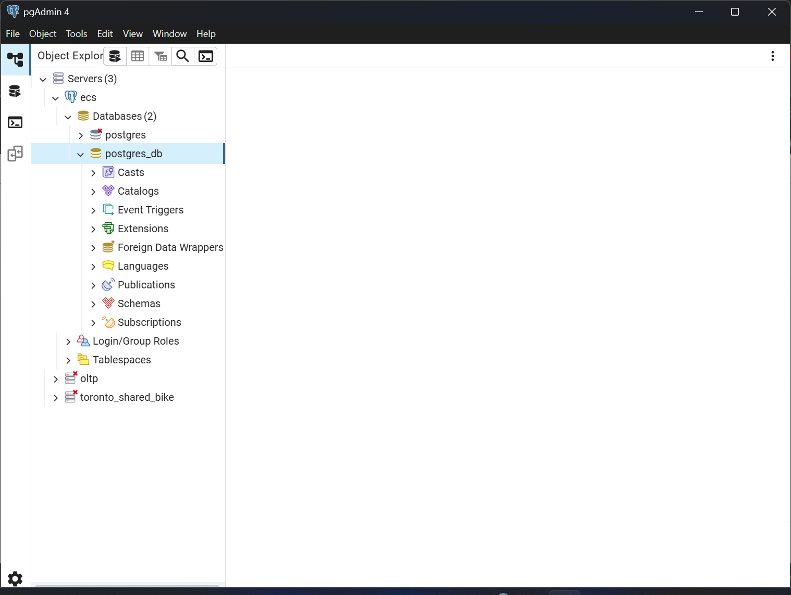
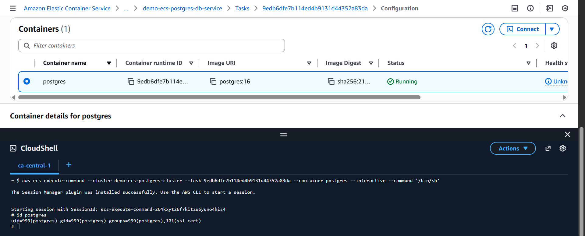

# Terraform Demo: ECS Fargate - Postgres(public)

## Terraform - Deploy

```sh
cd aws

terraform init -backend-config=backend.config
terraform fmt && terraform validate

terraform apply -auto-approve

terraform destroy -auto-approve
```

---

## Connect with PGAdmin 4



- Connect exec



---

## Persist Database - EFS Volume

```sql
CREATE TABLE demo(id int primary key, note text);
INSERT INTO demo VALUES (1,'hello');

SELECT * FROM demo;
-- 1	"hello"
```

- Stop and recreate task, connect db

```sql
SELECT * FROM demo;
-- 1	"hello"
```
